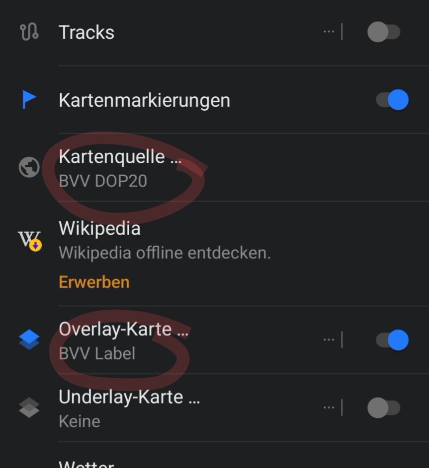
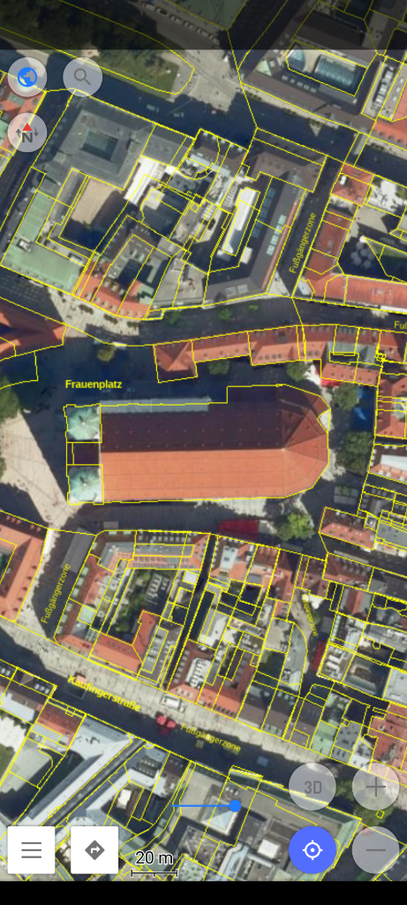

# bvv-offline
BVV-Opendata WMTS in OsmAnd anzeigen

Diese Beschreibung zeigt die Möglichkeit die OpenData-WMTS-Daten der Bayerischen Vermessungsverwaltung (BVV) in der OsmAnd-App anzuzeigen und offline zu nutzen.

Dies hilft evtl. darüber hinweg, dass der BayernAtlas nicht mehr offline nutzbar ist.

  1. OsmAnd installieren
     https://osmand.net/
     
  1. Die hier vorbereiteten OsmAnd-Einstellungen [herunterladen](bvv_maps.osf) (Link und "View raw" klicken) und mit OsmAnd importieren.  
     Die importierten BVV-Kartenquellen sind dann unter 🌍 -> Kartenquellen verfügbar.  
     Bei der ersten Nutzung von OsmAnd müssen die "Onlinekarten aktiviert" werden 

  1. Kacheln für Offline-Nutzung herunterladen:
     * Kartenlayer wählen
     * <<Lange auf die Karte drücken>> -> Aktionen -> "Karte herunterladen"
     * Zoomen, um Ausschnitt zu definieren
     * weiter nach unten scrollen, um Zoomstufen festzulegen
     * Anzahl der Bildkacheln und deren geschätzte Gesamtgröße wird angezeigt
     * Download mit "Herunterladen" beginnen

## Luftbild mit Parzellarkarte

Wählt man als Kartenquelle "BVV DOP20" und  als Overlay-Karte "BVV Label" hat man sogar eine Luftbildkarte

